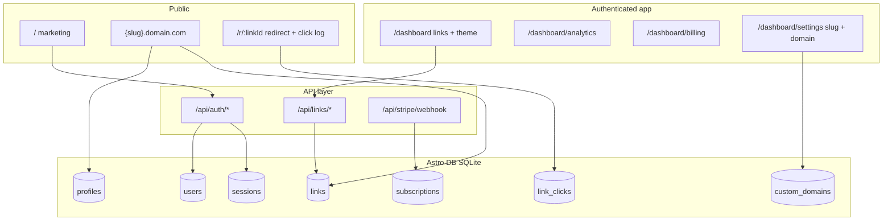
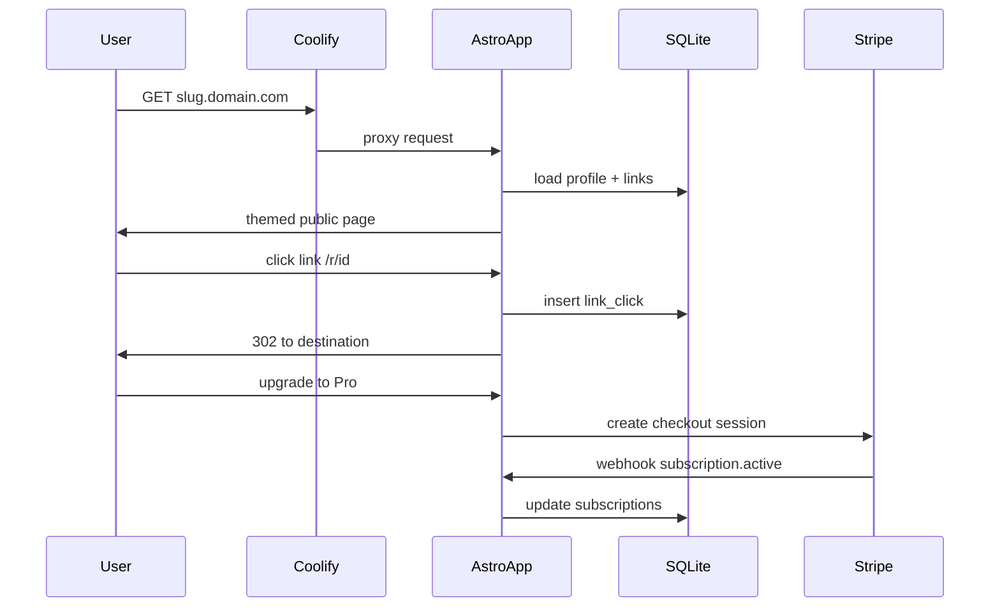

# Halamanlink — Linktree SaaS (Astro + SQLite)

## Goal

Create a new project at [`c:\Users\ndhan\projects\halamanlink`](c:\Users\ndhan\projects\halamanlink) that lets users sign up, customize a themed link-in-bio page, share it on a subdomain (`{slug}.yourdomain.com`), track clicks, and upgrade via Stripe. Your existing [`halaman`](c:\Users\ndhan\projects\halaman) project is a useful reference for tenant slug routing and billing patterns, but this will be a fresh Astro codebase.

## Architecture



## Tech stack

| Layer | Choice | Why |
|-------|--------|-----|
| Framework | Astro 5 + `@astrojs/node` (SSR) | Dashboard, auth, API routes, host-based routing |
| Database | `@astrojs/db` (libSQL/SQLite) | Matches your SQLite requirement; type-safe Drizzle queries via `astro:db` |
| Styling | Tailwind CSS 4 | Fast UI for marketing + dashboard + public themes |
| Auth | Session-based email/password (Lucia-style pattern from [Astro auth docs](https://docs.astro.build/en/guides/authentication/)) | Simple SaaS auth without heavy framework lock-in |
| Billing | Stripe Checkout + Customer Portal + webhooks | Standard SaaS subscriptions |
| Deploy | Coolify + Docker volume for SQLite file | Fits VPS deployment; subdomain routing via reverse proxy |

**Production SQLite note:** Coolify on a VPS can persist a local SQLite file at `.astro/content.db` (or a mounted path) using a Docker volume. Turso/`--remote` stays optional later if you move to edge/serverless.

## Data model ([`db/config.ts`](c:\Users\ndhan\projects\halamanlink\db\config.ts))

Core tables:

- **`users`** — `id`, `email` (unique), `passwordHash`, `name`, `createdAt`
- **`sessions`** — `id`, `userId`, `expiresAt`, `createdAt`
- **`profiles`** — `userId` (1:1), `slug` (unique), `displayName`, `bio`, `avatarUrl`, `theme` (json: colors, button style, font), `isPublished`
- **`links`** — `profileId`, `title`, `url`, `icon`, `sortOrder`, `isActive`
- **`link_clicks`** — `linkId`, `clickedAt`, `referrer`, `userAgent`, `ipHash` (privacy-safe analytics)
- **`subscriptions`** — `userId`, `stripeCustomerId`, `stripeSubscriptionId`, `plan` (`free`/`pro`), `status`, `currentPeriodEnd`
- **`custom_domains`** — `profileId`, `domain` (unique), `verified`, `verificationToken` (scaffold now; DNS verification in phase 2)

Seed file [`db/seed.ts`](c:\Users\ndhan\projects\halamanlink\db\seed.ts): demo user + sample profile/links for local dev.

## Routing and host resolution

### App routes (same origin, e.g. `app.halamanlink.com`)

| Route | Purpose |
|-------|---------|
| `/` | Marketing landing + pricing |
| `/signup`, `/login` | Auth pages |
| `/dashboard` | Link CRUD (add/edit/reorder/toggle) |
| `/dashboard/appearance` | Theme picker + avatar/bio |
| `/dashboard/analytics` | Clicks over time, top links |
| `/dashboard/billing` | Plan status, upgrade, Stripe portal |
| `/dashboard/settings` | Slug editor, custom domain form (stored, verified later) |
| `/r/[id]` | Redirect endpoint + click logging |

### Public profile routes (subdomain-first)

Middleware in [`src/middleware.ts`](c:\Users\ndhan\projects\halamanlink\src\middleware.ts):

1. Parse `Host` header
2. If host is `{slug}.{APP_DOMAIN}` → rewrite/render public profile for that slug
3. If host matches a verified row in `custom_domains` → render that profile (phase 2; table + lookup ready in phase 1)
4. Otherwise treat as main app host

Reference pattern from Halaman reserved slugs ([`halaman/front/app/[slug]/page.tsx`](c:\Users\ndhan\projects\halaman\front\app\[slug]\page.tsx)) — maintain a `RESERVED_SLUGS` list so routes like `login`, `dashboard`, `api` never become public profiles.

```typescript
// middleware host resolution (conceptual)
const host = request.headers.get("host") ?? "";
const appDomain = import.meta.env.APP_DOMAIN; // e.g. halamanlink.com
const sub = host.endsWith(`.${appDomain}`) ? host.slice(0, -(appDomain.length + 1)) : null;
if (sub && sub !== "app" && sub !== "www") {
  context.locals.profileSlug = sub;
}
```

Coolify setup: point wildcard DNS `*.halamanlink.com` to the app container; set `APP_DOMAIN=halamanlink.com`.

## Feature breakdown

### 1. Auth (signup/login/logout)

- [`src/lib/auth.ts`](c:\Users\ndhan\projects\halamanlink\src\lib\auth.ts) — password hashing (Web Crypto / scrypt), session create/validate/invalidate
- [`src/pages/api/auth/signup.ts`](c:\Users\ndhan\projects\halamanlink\src\pages\api\auth\signup.ts), `login.ts`, `logout.ts`
- HttpOnly session cookie, `export const prerender = false` on protected pages
- On signup: create `users` row + default `profiles` row with slug from username

### 2. Links dashboard (Linktree core)

- Server actions or API routes for CRUD
- Drag-and-drop reorder via lightweight client island (e.g. `@dnd-kit/core` — already familiar from Halaman)
- Fields: title, URL (validated), optional icon, active toggle
- Public page renders ordered active links with theme styles

### 3. Themes / appearance

- Preset themes (Minimal, Dark, Gradient, Bold) stored as JSON on `profiles.theme`
- Dashboard preview panel (live preview iframe or split view)
- Avatar upload: start with URL input; optional local `/public/uploads` on Coolify volume in follow-up

### 4. Analytics

- Every `/r/[id]` hit inserts `link_clicks`
- Dashboard queries: total clicks (7/30 days), clicks per link, simple daily chart
- No third-party tracker needed for MVP

### 5. Billing (Stripe)

Plans (suggested MVP):

| Plan | Limits |
|------|--------|
| Free | 5 links, 2 themes, basic analytics (7 days) |
| Pro | Unlimited links, all themes, full analytics, custom domain slot |

Implementation:

- [`src/lib/stripe.ts`](c:\Users\ndhan\projects\halamanlink\src\lib\stripe.ts) — Stripe client
- [`src/pages/api/stripe/checkout.ts`](c:\Users\ndhan\projects\halamanlink\src\pages\api\stripe\checkout.ts) — create Checkout Session
- [`src/pages/api/stripe/webhook.ts`](c:\Users\ndhan\projects\halamanlink\src\pages\api\stripe\webhook.ts) — sync `subscriptions` on `checkout.session.completed`, `customer.subscription.updated/deleted`
- [`src/pages/api/stripe/portal.ts`](c:\Users\ndhan\projects\halamanlink\src\pages\api\stripe\portal.ts) — billing portal link
- Enforce limits in link/theme/domain APIs using plan helper [`src/lib/plans.ts`](c:\Users\ndhan\projects\halamanlink\src\lib\plans.ts)

Borrow limit-check pattern from Halaman ([`halaman/front/app/api/tenant/domain/route.ts`](c:\Users\ndhan\projects\halaman\front\app\api\tenant\domain\route.ts)).

### 6. Custom domains (scaffold now, verify later)

Phase 1 (this build):

- Settings UI to save desired domain into `custom_domains`
- Show DNS instructions (CNAME → `app.yourdomain.com`)
- Block activation until verified

Phase 2 (follow-up after subdomain works on Coolify):

- Verification token TXT/CNAME check
- Host middleware lookup for verified domains
- SSL via Coolify/Traefik automatic certs

## Project structure

```
halamanlink/
├── astro.config.mjs
├── db/
│   ├── config.ts
│   └── seed.ts
├── src/
│   ├── middleware.ts
│   ├── lib/
│   │   ├── auth.ts
│   │   ├── db-queries.ts
│   │   ├── plans.ts
│   │   └── stripe.ts
│   ├── layouts/
│   │   ├── BaseLayout.astro
│   │   ├── DashboardLayout.astro
│   │   └── ProfileLayout.astro
│   ├── components/
│   │   ├── dashboard/   # LinkEditor, ThemePicker, AnalyticsChart
│   │   └── profile/     # PublicProfile, LinkButton
│   └── pages/
│       ├── index.astro
│       ├── signup.astro
│       ├── login.astro
│       ├── dashboard/
│       ├── p/[slug].astro          # fallback path-based public URL
│       ├── r/[id].ts               # redirect + analytics
│       └── api/
├── Dockerfile
├── docker-compose.yml              # optional local parity with Coolify
└── .env.example
```

Public profiles will work on **both** `{slug}.domain.com` (primary) and `/p/{slug}` (fallback for local dev without wildcard DNS).

## Coolify deployment

1. **Dockerfile** — multi-stage Astro Node build; expose port 4321
2. **Volume mount** — persist SQLite DB path (e.g. `/app/data/content.db`) via `ASTRO_DB_*` or libSQL file URL
3. **Env vars** — `APP_DOMAIN`, `APP_URL`, `STRIPE_SECRET_KEY`, `STRIPE_WEBHOOK_SECRET`, `STRIPE_PRICE_PRO_MONTHLY`, session secret
4. **DNS** — `app.` + wildcard `*.` CNAME to Coolify proxy
5. **Stripe webhook** — `https://app.halamanlink.com/api/stripe/webhook`



## Implementation order

Build vertically in thin slices so each step is testable on Coolify:

1. **Scaffold** — Astro + Node adapter + Astro DB + Tailwind + base layouts
2. **Auth + profile slug** — signup creates user/profile; login session; dashboard shell
3. **Links CRUD + public page** — subdomain middleware + `/p/[slug]` fallback + `/r/[id]` redirect
4. **Themes** — preset themes + appearance editor + public rendering
5. **Analytics** — click logging + dashboard charts
6. **Billing** — Stripe checkout/webhook/portal + plan enforcement
7. **Custom domain scaffold** — DB + settings UI + DNS instructions (verification deferred)
8. **Coolify** — Dockerfile, env template, wildcard subdomain test

## Out of scope for MVP

- Drag-and-drop full page builder (Halaman-style widgets)
- Team/multi-member accounts
- OAuth providers (can add GitHub/Google later)
- Full custom-domain SSL automation (phase 2)

## Success criteria

- User can sign up, set slug, add/reorder links, pick a theme, and view live page at `{slug}.yourdomain.com`
- Clicking a link records analytics visible in dashboard
- Free user hits plan limits; Stripe upgrade unlocks Pro features
- App runs on Coolify with persistent SQLite and wildcard subdomain routing
